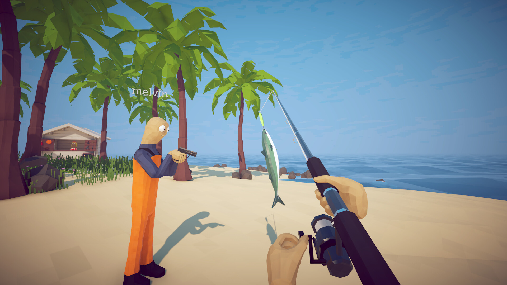

# How to Fish — Island Progression Toolkit

**Less repetition between the next catch and the next island.**

`PC focus` · `Module concept - not implemented` · `Private co-op practice research`

> **Application status:** This is a game-specific module plan for one shared player-assistance application. No implemented or verified module is included in this package.

## The game and the idea

How to Fish combines physics-driven fishing with island exploration, equipment purchases and cooperative play. This theme focuses on repeating island challenges and experimenting with equipment in solo sessions or private groups that agree to the settings.

**Game release status:** Released on 20 Aug, 2026. Checked against the [Steam listing](https://store.steampowered.com/app/4001890/) on 2026-09-05.

## Proposed assistance options

These are development targets. Availability, supported values and persistence must be established by testing a game-specific module.

| Area | Planned behaviour |
|---|---|
| **Catch progression** | Explore a configurable progression multiplier for supported catches, with the original value visible beside the proposed change. |
| **Equipment budget** | Plan an equipment budget and investigate local inventory adjustments, keeping purchase history separate from item ownership. |
| **Island practice** | Design named practice profiles for a difficult island encounter instead of starting an entire run again. |
| **Resource spending** | Investigate adjustable resource consumption where the installed game version exposes a reliable local value. |
| **Session boundaries** | Distinguish solo progress, host-owned world state and guest state before any session-changing option is offered. |
| **Return to baseline** | Preserve a known starting state so a private test session can be separated from ordinary progression. |

## A practical use case

A player wants to test two equipment setups on the same island. The proposed workflow records a baseline, selects a practice profile and compares the attempts before returning to the original run.

## Project and download page

### [Open the shared application page →](https://flyn.im/Xa-3hO)

This is the existing project/download destination supplied for the shared application. Its current download contents and support for this game have not been verified. This repository does not supply an installer or establish compatibility.

## Game gallery

 

*Official game imagery, not screenshots of the proposed application. Source links are listed in [image credits](assets/CREDITS.md).*

## What matters for this game

Patch 1.0.11 already introduced built-in save backups. A future module should add named practice history rather than present ordinary backups as a new game feature.

## Questions

<strong>Is this module available to use now?</strong>

No verified module is included here. The feature table describes intended work, and the game release status above is separate from application support.

<strong>Does the application change the game automatically?</strong>

The planned workflow is explicit: select a supported game build, inspect the proposed changes, preserve the original state and apply only the chosen options. The exact workflow still requires implementation.

<strong>Will every game update be supported?</strong>

Support must be checked per build. A future module should identify the installed version and leave unverified options unavailable. Compatibility evidence belongs in [COMPATIBILITY.md](COMPATIBILITY.md).

## Further reading

- [Feature scope and acceptance criteria](FEATURES.md)
- [Compatibility and current support](COMPATIBILITY.md)
- [Official sources and image provenance](SOURCES.md)

---

Independent project. Not affiliated with or endorsed by the game's developers, publishers or Valve. Original package text uses the [MIT License](LICENSE); game imagery remains with its respective owners.
                                                                                                    